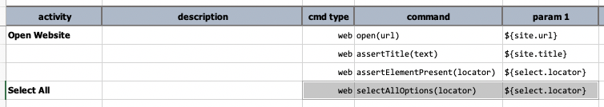
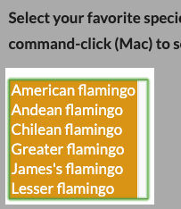

### Description
This command will select all `<OPTION>` elements from a `<SELECT>` element (a.k.a. list or combo box) matched by 
the specified `locator`. If the `locator` does not resolve to a valid `<SELECT>` element or no `<OPTION>` elements 
found under such `<SELECT>` element, then this will result in a FAIL result. If the resolved `<SELECT>` does not 
support multi-select, then this command will be considered as FAIL as well.

### Parameters
- **locator** - the locator of the `<SELECT>` element (e.g list box or combo box)

### Example
**Script**: 

**Before command execution**       &nbsp;&nbsp;&nbsp;&nbsp;&nbsp;&nbsp;&nbsp;&nbsp;&nbsp;&nbsp;&nbsp; **After command execution** 
&nbsp;&nbsp; &nbsp;&nbsp;&nbsp;&nbsp;&nbsp;&nbsp;&nbsp;&nbsp;&nbsp;&nbsp;&nbsp;&nbsp;&nbsp;&nbsp;&nbsp; 

### See Also
- [`deselect(locator,text)`](deselect(locator,text))
- [`deselectMulti(locator,array)`](deselectMulti(locator,array))
- [`select(locator,text)`](select(locator,text))
- [`selectMulti(locator,array)`](selectMulti(locator,array))
- [`selectMultiByValue(locator,array)`](selectMultiByValue(locator,array))
