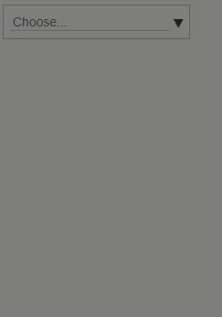
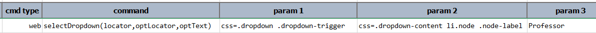

This command instructs Nexial to perform the following actions:
1. Click on a "dropdown" element that matches `locator`. Upon doing so, a list of clickable elements ("options") should 
   be displayed. This list of "options" is denoted as `optLocator`.
2. Click on one of the "option" elements which matches the specified `optLocator` and its text matches `optText`.

In effect, via this command Nexial simulates the selecting of an "option" from a dropdown (or combo) element, like the
one shown below: 

In order select an item from the dropdown (above), one would first click on the dropdown element and then the intended 
option underneath it. This command performs precisely these actions, with a few valuable caveats:
1. This command ensures the existence of the intended dropdown element.
2. Prior to clicking on the intended dropdown element, Nexial will attempt to scroll to the element so that it is
   visible on the page. Highlighting (via [`nexial.web.highlight`](../../systemvars/index#nexial.web.highlight)) is
   also supported.
3. After clicking on the intended dropdown element, this command internally waits for the dropdown option list to be 
   loaded.
4. This command support PolyMatcher (see below) when seeking for the appropriate dropdown option to select. For example,
   One may use `CONTAIN:Manager` to select the first option that contains the word `Manager`.



#### Note
- While this command simulates the selecting of a dropdown option, it is not the same as 
  [`select(locator,text)`](select(locator,text)), which targets the `<SELECT>` element.
- "Dropdown" is not a standard HTML component, and there are many implementations of such component. Care should be
  taken in terms of devising the right locators for the dropdown element and the dropdown options.

### Parameters
- **locator** - the locator of the dropdown element.
- **optLocator** - the locator of the dropdown options. This should be the locator that matches all options under the
  same dropdown.
- **optText** - the text to match against the dropdown options. The first dropdown options with the matching `optText` 
  will be clicked.

### Example
**Script**: 

### See Also
- [`select(locator,text)`](select(locator,text))
- [`selectMulti(locator,array)`](selectMulti(locator,array))
- [`selectMultiOptions(locator)`](selectMultiOptions(locator))
