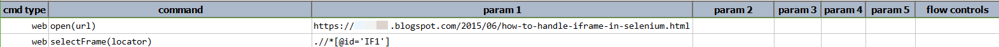
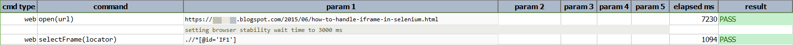

### Description
This command automates the focus on a frame/iframe of the current web page as indicated by its `locator`. With the right
locator, one can automate the toggling between multiple frames and their parent "page". In terms of locator, here are
the possibilities:

- `relative=top`: switching focus to the current page (where the frames are defined).
- `index=...`: switch focus to a frame based on its position on the current page. Frame index is zero-based. `index=2` 
  means the 3rd frame of the current page.
- `id=...`: switch focus to a frame based on the `id` attribute. 
- `name=...`: switch focus to a frame based on the `id` attribute.
- `XPATH`: switch focus to a frame based on the XPATH that would match it.

### Parameters

- **locator** - this parameter is the locator of the Iframe

### Example

**Script**: 

**Output**: 

### See Also