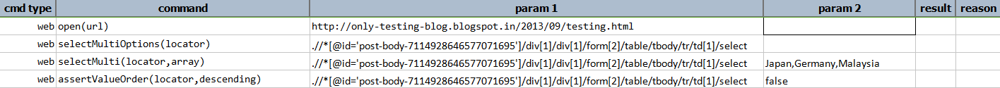
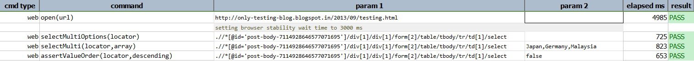

### Description

- This command is to selected multiple values from the multi select list box.
- In other words is user has to select multiple option from the listbox then this command will select the desired values and pass or else fail otherwise.

### Parameters

- **locator** - this parameter is the locator of the list or combo box element.
- **array** - this parameter is the item values to be selected in the list or combo Box.

### Example
**Script**: 

**Output**: 

### See Also

- [`selectMultiOptions(locator)`](selectMultiOptions(locator))
- [`deselectMulti(locator,array)`](deselectMulti(locator,array))