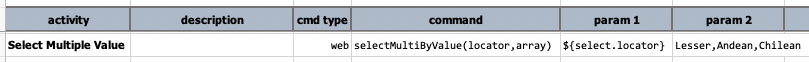
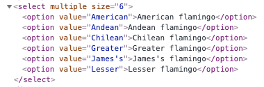
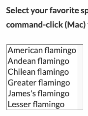
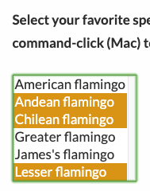

### Description
This command instructs Nexial to select (multiple possible) from the specified `<SELECT>` element.

The `locator` parameter is used to find the first matching `<SELECT>` element. If such element support multi-select 
(i.e. `<SELECT multiple ...>`), then all matching text from the specified `array` will be selected. If such `<SELECT>`
element does not support multi-select, then only the first matching child `<OPTION>` will be selected. 

`array` is the series of value to select from the resolved `<SELECT>` element. It can be expressed as a list separated
by [`nexial.textDelim`](../../systemvars/index#nexial.textDelim) or by newline character (i.e. each item as a separate 
line). Nexial will find the `<OPTION>` element with the matching `value` attribute and select it.

Note that this command selects the item(s) of a `<SELECT>` element based on their `value` attribute. To select the 
items under a `<SELECT>` element based on their rendered text, try [`selectMulti(locator,array)`](selectMultiBy(locator,array)).

### Parameters
- **locator** - this parameter is the locator of the list or combo box element.
- **array** - this parameter is the item values to be selected in the list or combo box (i.e. `<SELECT>`).

### Example
**Script**: 

Note that the underlying HTML for the target element: 

**Before command execution**                         &nbsp;&nbsp;&nbsp;&nbsp;&nbsp;&nbsp;&nbsp;&nbsp;&nbsp;&nbsp;&nbsp;&nbsp;&nbsp;&nbsp; **After command execution** 
&nbsp;&nbsp;&nbsp; &nbsp;&nbsp;&nbsp;&nbsp;&nbsp;&nbsp;&nbsp;&nbsp;&nbsp;&nbsp;&nbsp;&nbsp;&nbsp;&nbsp;&nbsp; 

### See Also
- [`deselect(locator,text)`](deselect(locator,text))
- [`deselectMulti(locator,array)`](deselectMulti(locator,array))
- [`select(locator,text)`](select(locator,text))
- [`selectAllOptions(locator)`](selectAllOptions(locator))
- [`selectMulti(locator,array)`](selectMulti(locator,array))
