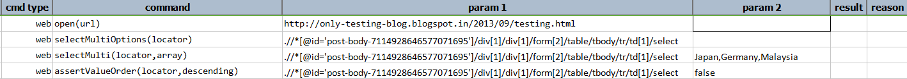
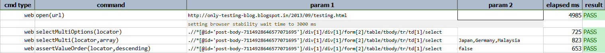

**DEPRECATED - USE [`selectAllOptions(locator)`](selectAllOptions(locator)) INSTEAD.**

### Description
This command will select **all** `<OPTION>` elements from a `<SELECT>` element (i.e. combo box) matched by 
`locator`. If the `locator` does not resolve to a valid `<SELECT>` element or no `<OPTION>` elements found, then this 
will result in a FAIL result. If the resolved `<SELECT>` element is found but does not support multi-select, then this
command will be considered as FAIL as well.

### Parameters
- **locator** - the locator of the `<SELECT>` element (e.g list box or combo box)

### Example
**Script**: 

**Output**: 

### See Also
- [`deselect(locator,text)`](deselect(locator,text))
- [`deselectMulti(locator,array)`](deselectMulti(locator,array))
- [`select(locator,text)`](select(locator,text))
- [`selectAllOptions(locator)`](selectAllOptions(locator))
- [`selectMulti(locator,array)`](selectMulti(locator,array))
- [`selectMultiByValue(locator,array)`](selectMultiByValue(locator,array))