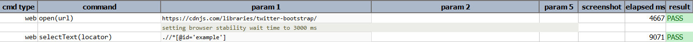

### Description

- This command is to select element Text as per found with locator.
- In other words the command will select is text found on the element and pass or else fail otherwise.
- Also make sure this command works if the attribute of the element contains "id".Meaning when xpath is defined it will look for attribute "id" in element.If found command would be successful and pass or else will throw error.

### Parameters

- **locator** - this parameter is the locator of the element\[ current it support only if the element as attribute 'id'\]

### Example

**Script**: 

**Output**: 

### See Also

- [`selectMultiOptions(locator)`](selectMultiOptions(locator))