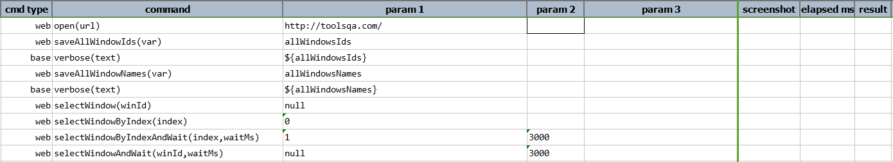
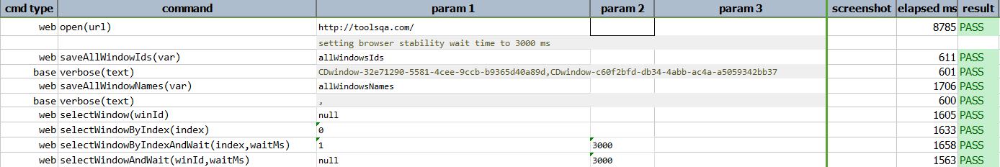

### Description

- This command is to select the window as per the windows ID provided.
- In other words command will locate the window as per the input and select the window and pass or else fail otherwise.

### Parameters

- **winId** - this parameter is the browser window Id.

### Example

**Script**: 

**Output**: 

### See Also

- [`saveAllWindowNames(var)`](saveAllWindowNames(var))
- [`selectWindowByIndex(index)`](selectWindowByIndex(index))
- [`selectWindowByIndexAndWait(index,waitMs)`](selectWindowByIndexAndWait(index,waitMs))
- [`selectWindowAndWait(winId,waitMs)`](selectWindowAndWait(winId,waitMs))
- [`saveAllWindowIds(var)`](saveAllWindowIds(var))