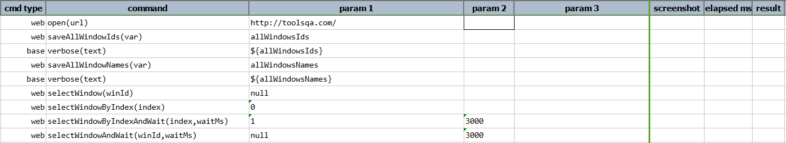
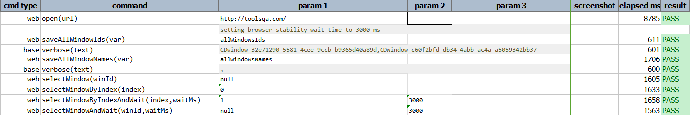

 
### Description

- This command will select the desired window and wait to desired time.
- This command can take null values and select the browser window which has the focus and is active.
- In other words the command will select the browser window if valid browser window id is provided and pass the command or else fail otherwise.
- Also this command can be used if there is one active browser windows and need to be selected, then null value can be passed to winId.

### Parameters

- **winId** - this parameter is the browser window id
- **waitMs** - this parameter is the wait time 

### Example

**Script**: 

**Output**: 
       

### See Also

- [`saveAllWindowNames(var)`](saveAllWindowNames(var))
- [`selectWindow(winId)`](selectWindow(winId))
- [`selectWindowByIndex(index)`](selectWindowByIndex(index))
- [`saveAllWindowIds(var)`](saveAllWindowIds(var))
