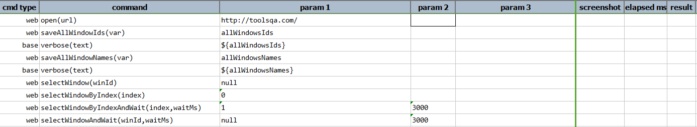
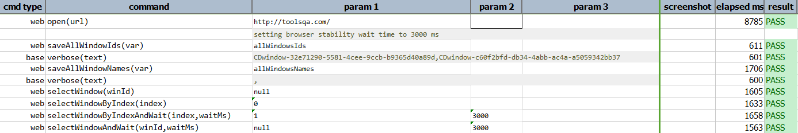

### Description

- This command is to select an open tab/window by index, which are determined on the order of when the corresponding window/tab being opened.

### Parameters

- **index** - this parameter is the index number of the browser windows 

### Example

**Script**: 

**Output**: 

### See Also

- [`saveAllWindowNames(var)`](saveAllWindowNames(var))
- [`selectWindow(winId)`](selectWindow(winId))
- [`selectWindowByIndexAndWait(index,waitMs)`](selectWindowByIndexAndWait(index,waitMs))
- [`selectWindowAndWait(winId,waitMs)`](selectWindowAndWait(winId,waitMs))