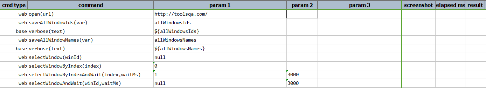
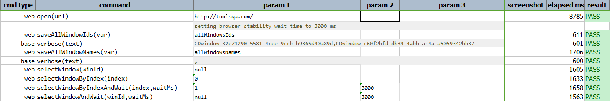

### Description
This command is to select browser window by index and wait for desired time. In other words the command will select 
the window on the basis of the index identified, wait for the time specified and will pass or else fail otherwise.

### Parameters
- **index** - this parameter is the index number of the browser windows
- **waitMs** - this parameter is the time to wait once the desired browser window is identified.

### Example
**Script**: 

**Output**: 

### See Also
- [`saveAllWindowNames(var)`](saveAllWindowNames(var))
- [`selectWindow(winId)`](selectWindow(winId))
- [`selectWindowByIndex(index)`](selectWindowByIndex(index))
- [`selectWindowAndWait(winId,waitMs)`](selectWindowAndWait(winId,waitMs))
