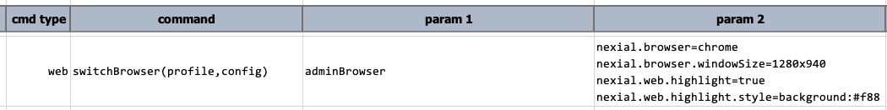
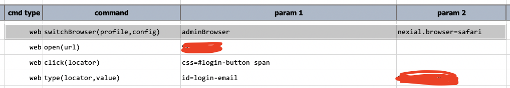
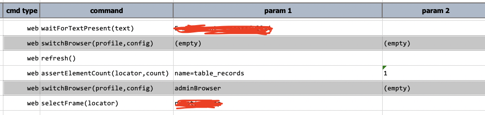

### Description
This command instructs Nexial to suspend the automation on the current browser (if any) and switch the automation to 
another browser instance. 

At times, it is critical to automate with multiple independent browser to browser to sufficiently validate the intended 
functionality of the target application. In the context of automation, "independent browsers" means browsers that are 
sequestered from each other in terms of processes and session management. As such, one can toggle automation between
multiple personae and their respective browsing experience. It is then possible to observe and validate the intended
consequences of these personae independently interacting with the application. For example, we can use this command to
simulate 2 users bidding (online) on the same product, or to simulate 2 (or more) users chatting online via the same
channel.

This command takes 2 parameters: `profile` is an user-defined _identifier_ to reference a specific browser instance. 
One can toggle between multiple browser instances using the `profile` parameter. The `config` parameter is a set of
name-value configurations to determine the construct of a browser instance. Each name-value pair would take up a line, 
or separated by comma. For example, 

This means to switch the automation to another browser, referenced as `adminBrowser`, which :
1. shall be a Chrome browser (whatever version currently installed on the automation host),
2. shall be resized to a 1280 by 940 window size,
3. shall have element highlighting turned on so that the web elements will be "highlighted" as they are referenced by 
   the automation script,
4. shall use "light red" background color as the highlight

Just about any [System variables](../../systemvars/) prefixed by `nexial.browser` or `nexial.web` can be included in 
the `config` parameter. If no special configuration is needed, simply use `(empty)` or `(blank)` instead.

After this command is executed, any subsequent [web] commands will take effect on the newly switched-to browser. To 
switch to another browser instance, simply issue this command again with another `profile` name. To switch to the 
initial/default browser, the `profile` parameter should be `(empty)`.

### Parameters
- **profile** - a new or existing browser, referenced by this `profile` parameter. Use `(empty)` for the default browser.
- **config** - a set of name-value configuration to determine the behavior of the browser referenced via `profile`.

### Example
**Script**: switch to another Safari browser 

**Script**: switch back to the default browser (denote as `(empty)`), and then switch again to the `adminBrowser` 
browser instance. 

Note that the `config` parameter for `adminBrowser` is `(empty)` the second time. When `config` parameter is missing,
previous configuration (i.e. `nexial.browser=safari`) will be used instead.

### See Also
