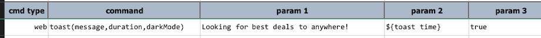
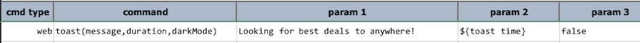
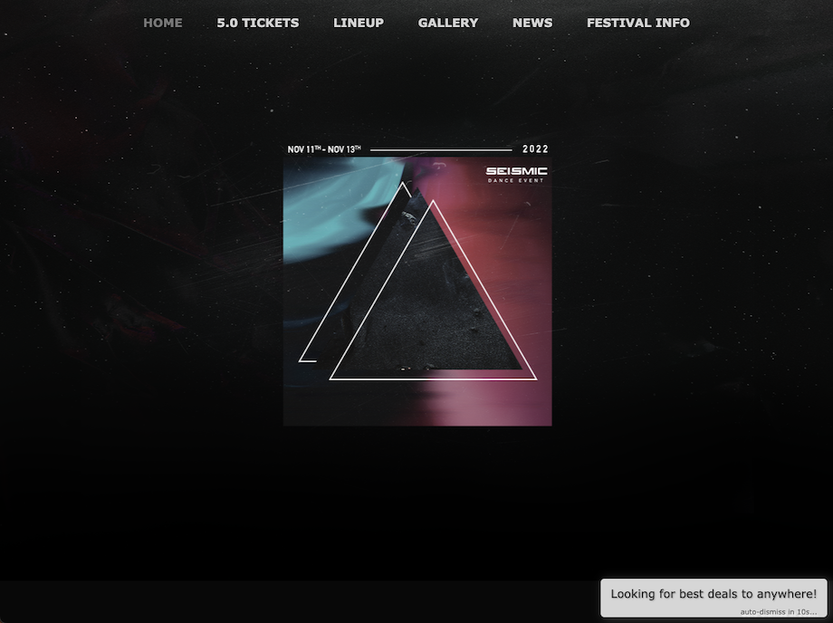
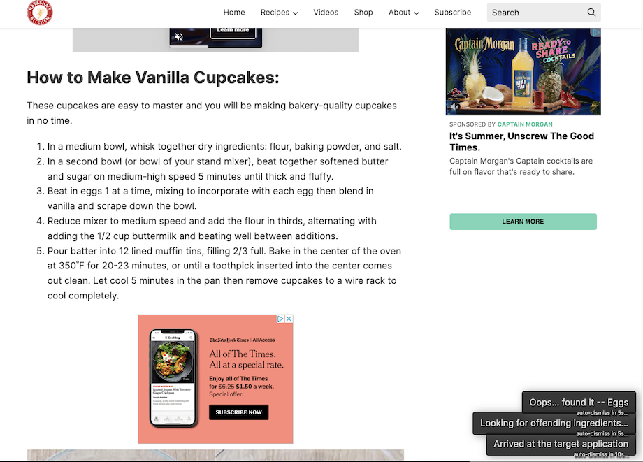

### Description
This command instructs Nexial to inject a small, non-intrusive, self-dismissed dialog component (a.k.a.
<a href="https://spectrum.adobe.com/page/toast/" class="external-link" link="nexial_link">"toast" notification</a>) near 
the bottom-right corner of the current web page. The main purpose of such command is not automation or testing, but 
rather, as a way of communicating in-flight activity or intention so that the audience of such automation might be 
better informed. For example, 

... would result in a small dialog box to appear near the bottom-right corner of the current web page: 

In addition to provide intent of the automation (during automation), one may also use this command to provide additional
insights regarding the target application or the current automation -- perhaps information that is otherwise subtle or
hidden from plain sight. For example, one could use this command to inform his/her audience that a page needs to be 
reloaded to reflect change in certain system status.

The `message` parameter is used to indicate the text to display in the toast notification. The `duration` parameter
allows one to adjust the time (in millisecond) such toast notification should stay visible. Lastly, the `darkMode`
parameter allows one to specify whether a "dark" toast notification should be used instead of a "light" one. Here is 
an example of a "light" toast notification: 

Note that successive invocations of this command might cause multiple notification to stack up, with the newer ones on
top of the older ones, like this: 

This can be an effective technique in some situations. It is important to be mindful of the `duration` parameter per 
notification.

### Parameters
- **message** - the text to display as notification
- **duration** - the time, in millisecond, for which a toast notification would remain visible
- **darkMode** - `true` to display toast notification in dark mode, `false` for light mode (see screenshots above).

### Example
See above

### See Also
- [`nexial.web.toastDescriptionDarkMode`](../../systemvars/content.html#nexial.web.toastDescriptionDarkMode)
- [`nexial.web.toastDescriptionWaitMs`](../../systemvars/content.html#nexial.web.toastDescriptionWaitMs)
- [`nexial.web.toastDescription`](../../systemvars/content.html#nexial.web.toastDescription)