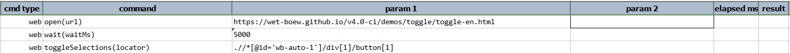
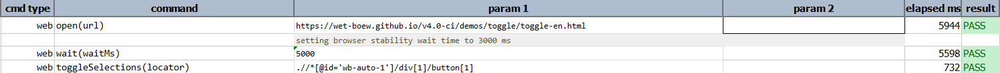

### Description

- This command is to toggle the selection on the web page.
- In other words the command will toggle the button as per the locator identified and pass or else fail otherwise.

### Parameters

- **locator** - this parameter is the locator of the element.

### Example

**Output**: 

### See Also

- [`select(locator,text)`](select(locator,text))