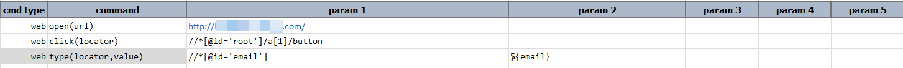
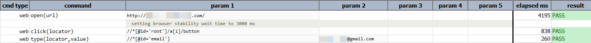

### Description
This command instructs Nexial to enter the specified `value` into the first element that matches the specified 
`locator`. In almost all cases, such element is either a textbox or a textarea. Note that this command will overwrite 
any existing text of the target element. If the specified `value` is `(empty)`, then the text of the target element will 
be cleared.

Note that this is not exactly the same as in setting the `value` attribute of a textbox element. Many of the modern or
the more-sophisticated Web frontend frameworks do not equate the entering of text as the same as setting the `value`
attribute of a textbox or textarea element.

### Parameters
- **locator** - this parameter is xpath locator of the element
- **value** -  this parameter is the actual value to be typed into element.  Use `(empty)` to clear out the text in 
  the target element

### Example
**Script**: 

**Output**: 

### See Also

- [`web`](index)