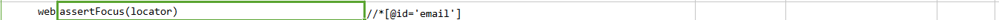
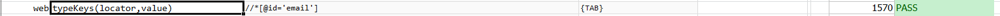

### Description
This command automates the issuing of keystrokes on the target the web element as specified via `locator`.  Keystrokes 
maybe alphanumeric, punctuations, control keys (see below), or a combination of them.  A combination of keys and 
controls are supported. If the specified `locator` does not result in a valid web element, then this command will FAIL.  
If the specified `value` is `(empty)`, then the target element is effectively "cleared out" - meaning, any of its 
existing text is removed. 

The acceptable control keys are as follows:
```
{SHIFT}
{CONTROL}
{ALT}
{META}
{WIN}
{COMMAND}

{TAB}
{BACKSPACE}
{BKSP}
{SPACE}
{ENTER}
{INSERT}
{DELETE}
{ESCAPE}
{HOME}
{END}
{LEFT}
{RIGHT}
{UP}
{DOWN}
{PAGEUP}
{PAGEDOWN}
{F1}
{F2}
{F3}
{F4}
{F5}
{F6}
{F7}
{F8}
{F9}
{F10}
{F11}
{F12}
```




### Parameters
- **locator** - this parameter is the locator of the element.
- **value** - this parameter is the key value which need to be send.


### Example
**Script**:<br/>



**Output**:<br/>



### See Also
- [`type(locator,value)`](type(locator,value))
- [desktop &raquo; `typeKeys(os,keystrokes)`](../desktop/typeKeys(os,keystrokes))
