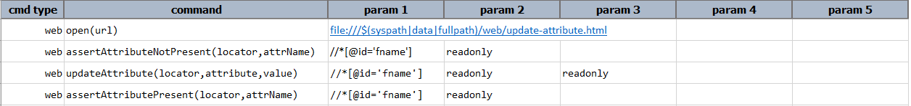
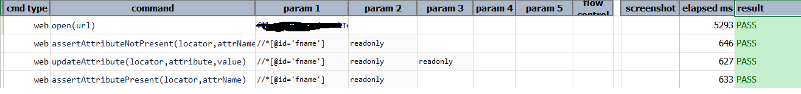
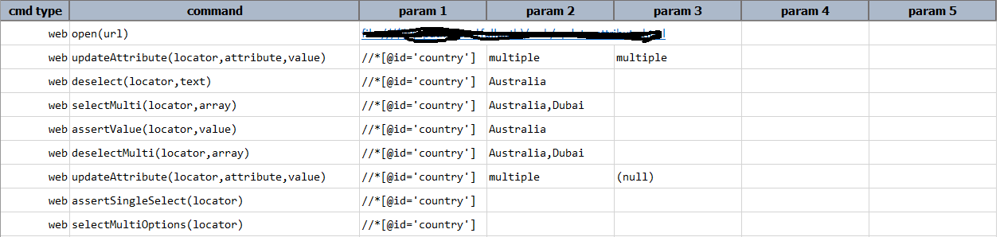
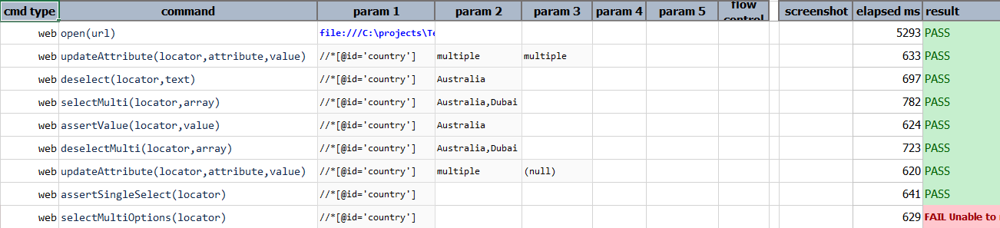
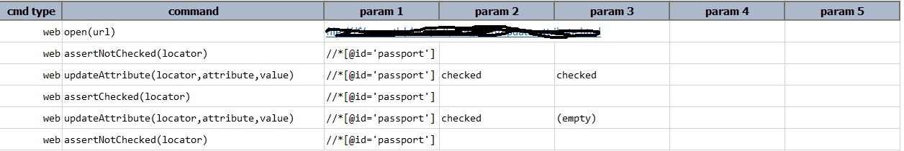
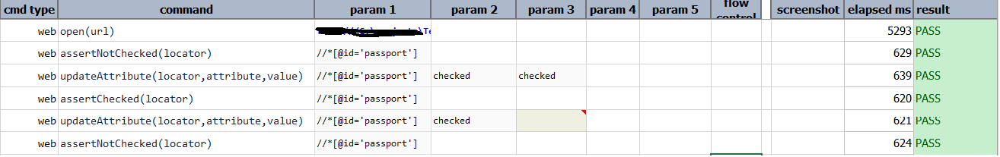

### Description
This command instructs Nexial to update the attribute (denote by `attrName`) of an Web element (denote by `locator`) 
with the specified `value`. If `value` is empty (as in `(empty)`) or null (as in `(null)`), then the specified 
attribute (`attrName`) will be removed .

### Parameters
- **locator** - locator of the target element.
- **attrName** - attribute of the element.
- **value** - value of the attribute.

### Example
#### Example #1
**Script**: 

**Output**: 

#### Example #2
**Script**: 

**Output**: 

#### Example #3
**Script**: 

**Output**: 

### See Also
- [`assertAttribute(locator,attrName,value)`](assertAttribute(locator,attrName,value))
- [`assertAttributeContain(locator,attrName,contains)`](assertAttributeContain(locator,attrName,contains))
- [`assertAttributeNotContain(locator,attrName,contains)`](assertAttributeNotContain(locator,attrName,contains))
- [`assertAttributeNotPresent(locator,attrName)`](assertAttributeNotPresent(locator,attrName))
- [`assertAttributePresent(locator,attrName)`](assertAttributePresent(locator,attrName))
- [`saveAttribute(var,locator,attrName)`](saveAttribute(var,locator,attrName))
- [`saveAttributeList(var,locator,attrName)`](saveAttributeList(var,locator,attrName))
