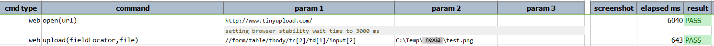

### Description

*   This command is used to upload file in web browser.
*   in other words command will upload the file in web browser and pass or else fail otherwise.

### Parameter(s)

- **fieldLocator** - this parameter is the locator of the element on clicking or selecting the windows upload dialog will open.
- **file** - this parameter is the file along with the location which has to be uploaded.

### Example

Script:

Output:

### See Also
