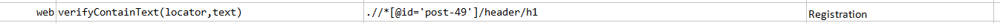

### Description

- This command is to verify the text of the element.
- In other words the command will verify the text on the element if found or else fail otherwise.

### Parameters

- **locator** - this parameter is the locator of the element.
- **text** - this parameter is the text to find and verified on the element.

### Example

**Script**: 

**Output**: 

### See Also

- [`assertElementByText(locator,text)`](assertElementByText(locator,text))
- [`assertElementPresent(locator)`](assertElementPresent(locator))