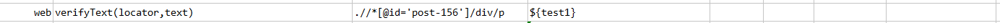
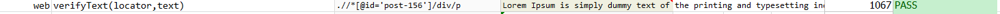

### Description

- This command is to verify  text of the element.
- In other words command will verify the text if found or else fail otherwise.

### Parameters

- **locator** - this parameter is the locator(xpath) of the element.
- **text** -  this parameter is the text to be verified in that element. 

### Example

**Script**: 

**Output**: 

### See Also

- [`assertText(locator,text)`](assertText(locator,text))