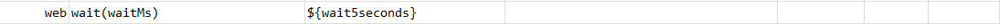

### Description

- This command is to wait till the desired time(in milli seconds) as passed as input parameters.
- The command will wait till the desire time and pass or else fail otherwise.

### Parameters

- **waitMs** - this parameter is the time defined to wait.\[ Remember time need to be defined in milliseconds\]

### Example

**Script**: 

**Output**: 

### See Also

- [`openAndWait(url,waitMs)`](openAndWait(url,waitMs))
- [`waitFor(waitMs)`](../base/waitFor(waitMs))