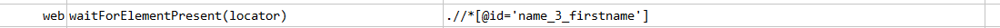
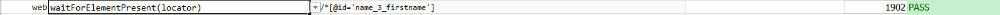

### Description

- This command is to wait for element on the page.
- In other words the command will wait for element till is active on the page.
- The command will pass if the element is found or else fail otherwise.

### Parameters

- **locator** - this parameter is the locator of the element.

### Example

**Script**: 

**Output**: 

### See Also

- [`waitForTitle(text)`](waitForTitle(text))