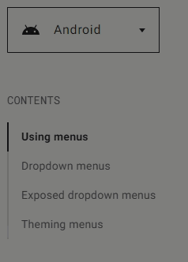

### Description
This command instructs Nexial to wait for the presence of an element in the current web page which
1. matches to the specified `locator`, and
2. contains the specified `text` (supports PolyMatcher; see below)

The amount of time to wait is determined by [`nexial.pollWaitMs`](../../systemvars/index#nexial.pollWaitMs), in 
milliseconds.

This command is especially useful when the specified `locator` can be matched against a list of elements that are loaded
dynamically  (i.e. AJAX or dynamic DOM rendering via JavaScript). As such, the target element might not be available at 
the moment when it is needed. One can use this command to wait for (and ensure) the availability of the intended element 
before proceeding to interacting with it.



### Parameters
- **locator** - The locator (or selector) to seek out potential target element(s). Note that Nexial will perform this 
  operation until the time specified via [`nexial.pollWaitMs`](../../systemvars/index#nexial.pollWaitMs).
- **text** - The text of the target element to seek out. Internally, Nexial will trim the element text prior to matching 
  it. PolyMatcher is supported.

### Example
Suppose we have a list of clickable elements that is dynamically loaded upon activation: 

We can use this command to wait for the intended target to be loaded/present before acting upon it: 

### See Also
- [`waitForElementPresent(locator)`](waitForElementPresent(locator))
- [`waitForElementsPresent(locators)`](waitForElementsPresent(locators))
- [`waitForTitle(text)`](waitForTitle(text))
