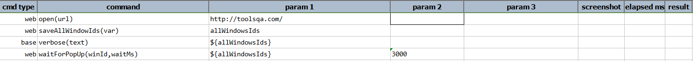
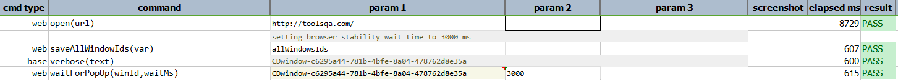

### Description

- This command is to wait for the desired web windows browser pop up.
- In other words command will look for pop up till the desired window id and wait for the desired time and pass or else fail otherwise.

### Parameters

- **winId** - this parameter is the window Id to wait for.
- **waitMs** - this parameter is the wait time.

### Example

**Script**: 

**Output**: 

### See Also

- [`selectWindow(winId)`](selectWindow(winId))
- [`selectWindowByIndex(index)`](selectWindowByIndex(index))
- [`selectWindowByIndexAndWait(index,waitMs)`](selectWindowByIndexAndWait(index,waitMs))
- [`selectWindowAndWait(winId,waitMs)`](selectWindowAndWait(winId,waitMs))