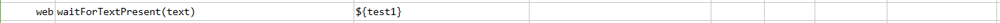
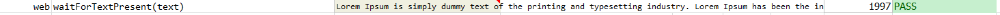

### Description

- This command is to wait for text present on the page.
- In other words command will wait till the defined text is present on the page.
- The command will pass if text found or else fail otherwise.

### Parameters

- **text** - this parameter is the text to be present on the page.

### Example

**Script**: 

**Output**: 

### See Also

- [`waitForTitle(text)`](waitForTitle(text))
- [`assertText(locator,text)`](assertText(locator,text))
- [`verifyText(locator,text)`](verifyText(locator,text))