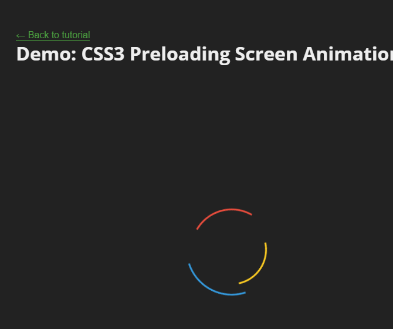
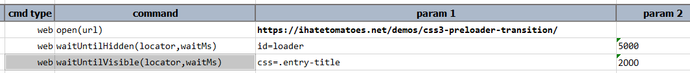

### Description
Ths command instructs Nexial to continuously poll for a Web element (denoted by `locator`) until it becomes visible.
If the target element is already visible at the start of this command, then this command will end immediately with a
**PASS**. If not, this command will poll for the target web element to become visible until the specified `waitMs`. If
the target element is not visible or not found when `waitMs` time is reached, this command will return with a **FAIL**.

### Parameters
- **locator** - the locator of the target element.
- **waitMs** - the maximum amount of time to wait for said condition.

### Example
The following website contains a "spinner" while the web page : 
 

At the end of the count down, the "Please wait..." button will change to "Click Me!" 
 

We can use this command to wait until the "Click Me!" button becomes visible. Like this:

**Script**: 
 

Note that Nexial will end the wait as soon as the target element becomes visible (instead of waiting for the entire 
specified `waitMs` time).

### See Also
- [`waitForElementPresent(locator,waitMs)`](waitForElementPresent(locator,waitMs)) 
- [`waitForElementsPresent(locators)`](waitForElementsPresent(locators)) 
- [`waitUntilDisabled(locator,waitMs)`](waitUntilDisabled(locator,waitMs))
- [`waitUntilEnabled(locator,waitMs)`](waitUntilEnabled(locator,waitMs))
- [`waitUntilHidden(locator,waitMs)`](waitUntilHidden(locator,waitMs))
