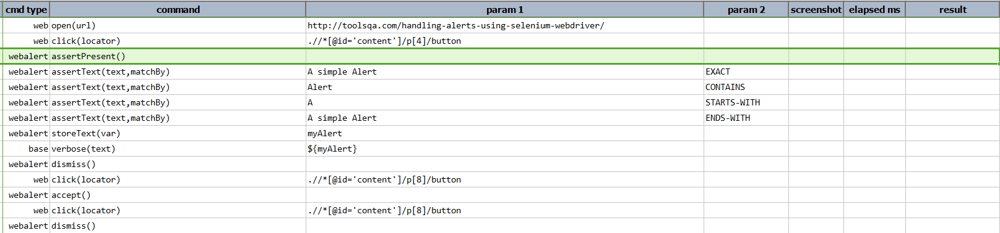
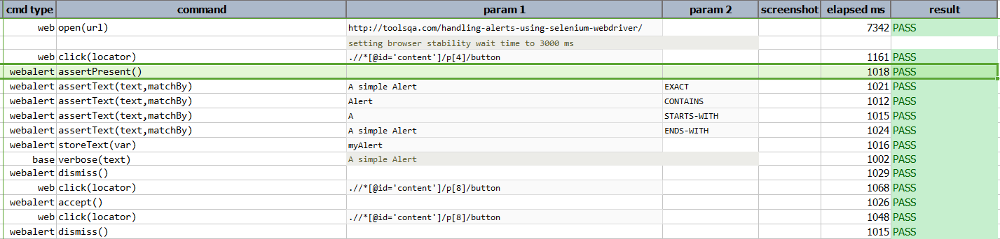

### Description
This command asserts any alert window present on the web page.  If any Alert dialog exists, the command will pass or 
else fail otherwise.  There is not input parameter required for this command.

### Example
**Script**: 

**Output**: 

### See Also
- [`dismiss()`](dismiss())
- [`accept()`](accept())
- [`assertText(text,matchBy)`](assertText(text,matchBy))
