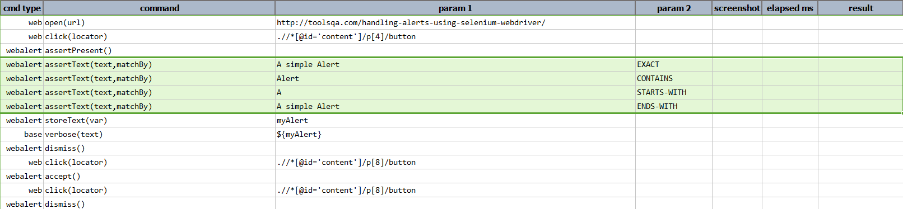
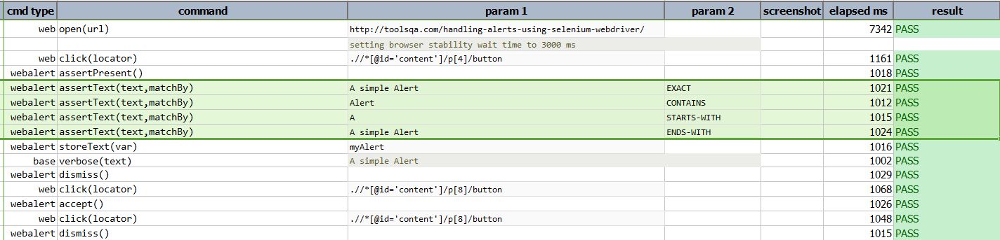

### Description
This command assert if the text of the alert dialog matches to `text`.

There are different ways to specify the matching logic (`matchBy`):
- EXACT
- CONTAINS
- STARTS_WITH
- ENDS_WITH.

The text of the alert dialog, if present, will be saved to `nexial.lastAlertText`, which can be retrieved after this
command is executed.

### Parameters
- **text** - this parameter is the actual text to be asserted.
- **matchBy** - this parameter is to define how the text need to be asserted.

### Example
**Script**: 

**Output**: 

### See Also
- [`assertPresent()`](assertPresent())
- [`accept()`](accept())
- [`dismiss()`](dismiss())
- [`storeText(var)`](storeText(var))
