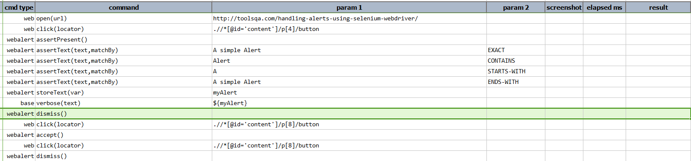
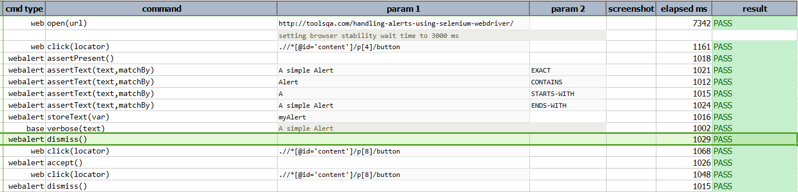

### Description
This command dismisses any currently-present alert dialog.  

The text of the alert dialog, if present, will be saved to `nexial.lastAlertText`, which can be retrieved after this
command is executed.

### Parameters

### Example
**Script**: 

**Output**: 

### See Also
- [`accept()`](accept())
- [`assertPresent()`](assertPresent())