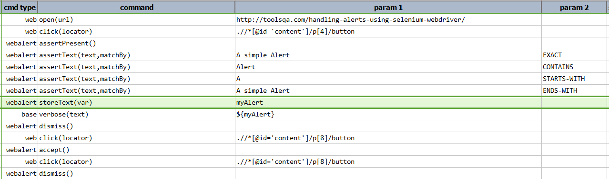
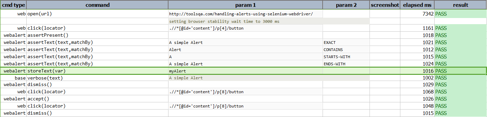

### Description
This command stores the text of the alert dialog to variable denoted by `var`.  If no alert dialog is found, or 
retrieval of dialog text is not possible, this command will FAIL.

### Parameters
- **var** - this parameter is the variable for the text to be stored.

### Example
**Script**: 

**Output**: 

### See Also
- [`accept()`](accept())
- [`assertPresent()`](assertPresent())
- [`assertText(text,matchBy)`](assertText(text,matchBy))
- [`dismiss()`](dismiss())
