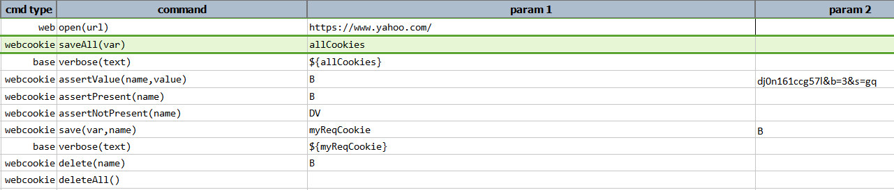
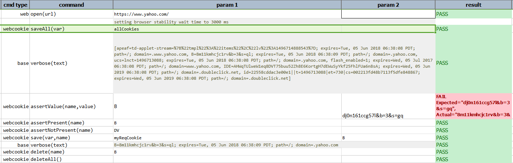

### Description
This command asserts that the specified cookie is not present for current URL.

### Parameters
- **name** - the cookie name to assert

### Example
**Script**: 

**Output**: 

### See Also
- [`assertValue(name,value)`](assertValue(name,value))
- [`assertPresent(name)`](assertPresent(name))
- [`delete(name)`](delete(name))
- [`deleteAll()`](deleteAll())
