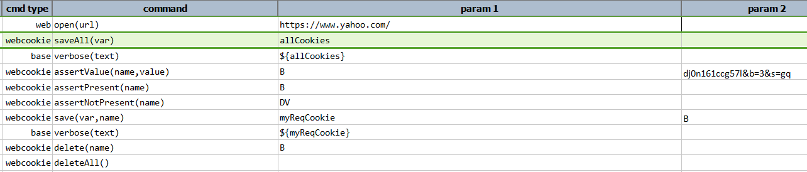
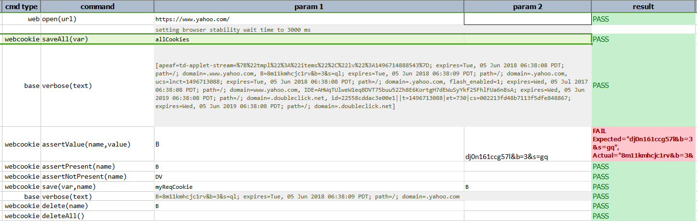

### Description
This command asserts the `value` of a cookie specified by `name`.

### Parameters
- **name** - the name of the cookie
- **value** - the expected value of the cookie.

### Example
**Script**: 

**Output**: 

### See Also
- [`assertPresent(name)`](assertPresent(name))
- [`assertNotPresent(name)`](assertNotPresent(name))
- [`delete(name)`](delete(name))
- [`deleteAll()`](deleteAll())
