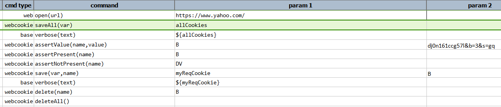
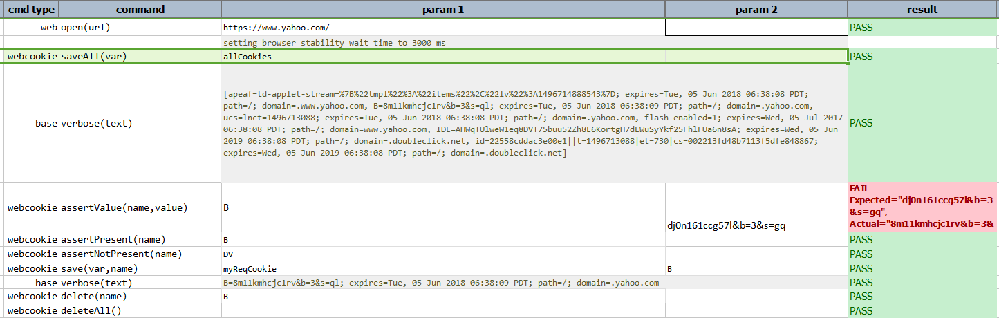

### Description
This command deletes the specified cookie by `name`.

### Parameters
- **name** - the name of the cookie to be deleted.

### Example
**Script**: 

**Output**: 

### See Also
- [`assertValue(name,value)`](assertValue(name,value))
- [`assertPresent(name)`](assertPresent(name))
- [`assertNotPresent(name)`](assertNotPresent(name))
- [`deleteAll()`](deleteAll())

