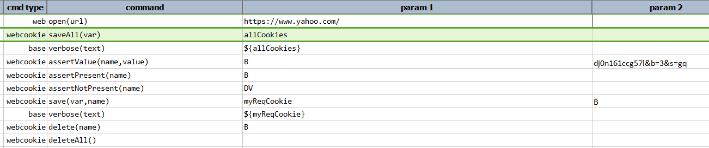
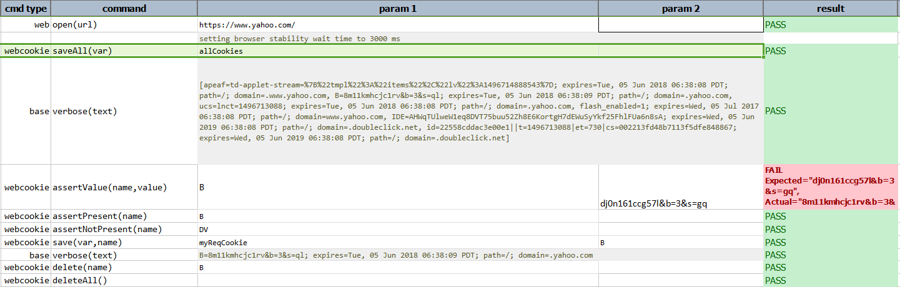

### Description
This command delete all cookie from the current web page session.

### Example
**Script**: 

**Output**: 

### See Also
- [`assertValue(name,value)`](assertValue(name,value))
- [`assertPresent(name)`](assertPresent(name))
- [`assertNotPresent(name)`](assertNotPresent(name))
- [`delete(name)`](delete(name))
