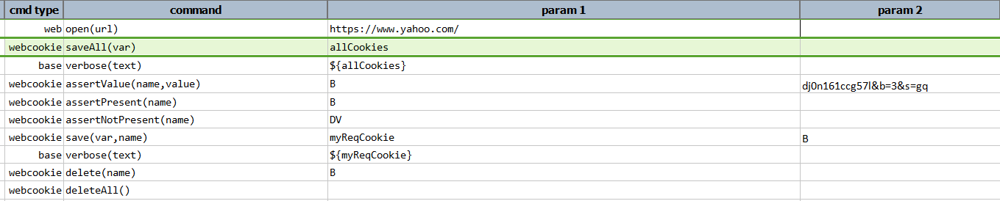
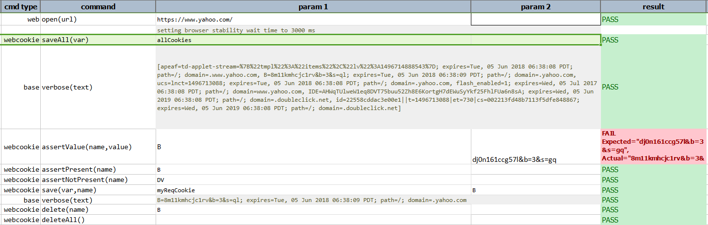

#### Description
This command saves the cookie (name, value, path, etc.) into variable.

### Parameters
- **var** - the variable to store the cookie with name `name`.
- **name** - the name of the cookie to save.

### Example
**Script**: 

**Output**: 

### See Also
- [`assertValue(name,value)`](assertValue(name,value))
- [`assertPresent(name)`](assertPresent(name))
- [`delete(name)`](delete(name))
- [`deleteAll()`](deleteAll())
