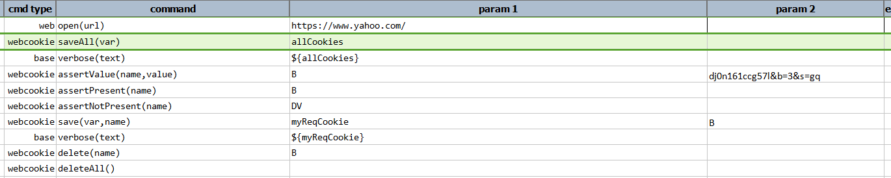
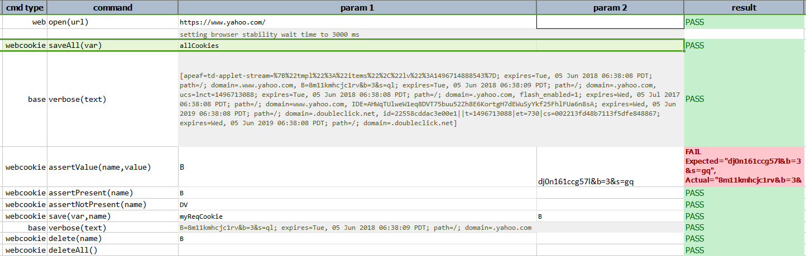

### Description
This command saves all the cookies, as a list, in `var`.

### Parameters
- **var** - the variable where the cookies will be stored.

### Example
**Script**: 

**Output**: 

### See Also
- [`assertNotPresent(name)`](assertNotPresent(name))
- [`assertPresent(name)`](assertPresent(name))
- [`assertValue(name,value)`](assertValue(name,value))
- [`delete(name)`](delete(name))
- [`deleteAll()`](deleteAll())
- [`saveAllAsText(var,exclude)`](saveAllAsText(var,exclude))
