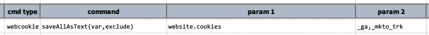
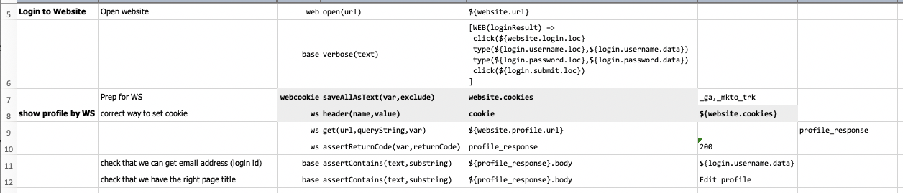

### Description
This command saves all the cookies, as text, as a data variable denoted by `var`. One can omit certain cookie(s) via
the `exclude` parameter. Simply specify one or more cookie names to omit (separated by 
[`nexial.textDelim`](../../systemvars/index.html#nexial.textDelim)) via the `exclude` parameter. For example:

The above example will save all the cookie currently set to browser under automation, except for those whose name is 
`_ga` or `_mkto_trk` (click tracker cookies).

If no cookie is to be omitted, simply ignore the `exclude` parameter or use `(empty)` for it.

### Parameters
- **var** - the variable where the cookies will be stored.
- **exclude** - a list of cookie name(s) to exclude from this command.

### Example
**Script**: 

The above example performs the following steps:
1. **Row 5-6**: navigate to the intended website (denoted as `${website.url}`) and login via 
   [WEB expression](../../expressions/WEBexpression).
2. **Row 7**: save all the cookies set to browser at this point in time, which, in this case, also includes the web session 
   cookies. Note that the `_ga` and `_mkto_trk` cookies (click tracker) are omitted.
3. **Row 8**: Before performing a web service call, [HTTP request header](../ws/header(name,value)) must be properly set. 
   Here we are setting the cookies saved from Row 7 to the HTTP request header `cookie`.
4. **Row 9**: Now it's time to make the web service call. At this time, the HTTP request header has been set with the cookie
   information saved from Row 7.
5. **Row 10-12**: These steps validate that the web service call was invoked correctly and the response contains expected
   content (including the login username).

### See Also
- [`save(var,name)`](save(var,name))
- [`saveAll(var)`](saveAll(var))
