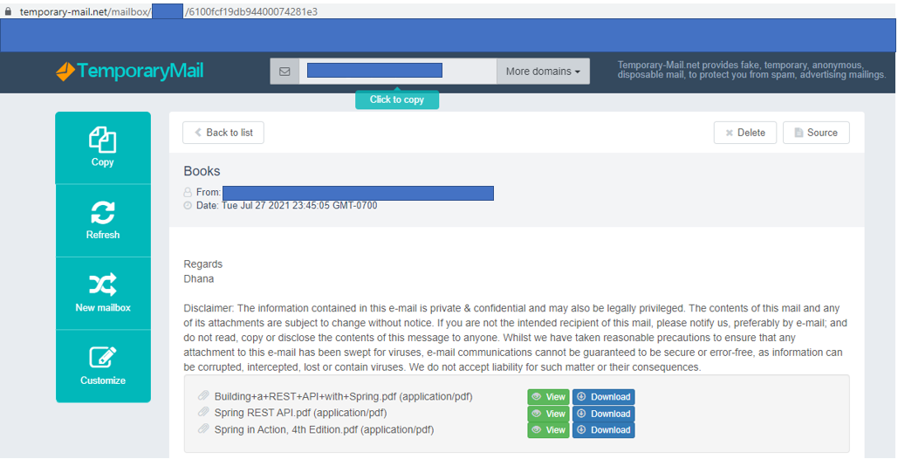

### Description
This command instructs Nexial to download an `attachment` from the email with the given `id` corresponding to the 
[`profile`](index#webmail-configuration-settings). The `saveTo` represents the target "path" to which
the attachment should be downloaded.

This "email id" is determined during the 
[`search(var,profile,searchCriteria,duration)`](search(var,profile,searchCriteria,duration)) command.

### Points to Remember

The following points to be taken into consideration before using the attachment commands.

- For the attachments command to work the email provider should be "temporary-mail". So the `provider` value
in the [profile](index#webmail-configuration-settings) should be *temporary-mail*.
- [temporary-mail](https://temporary-mail.net) allows attachments size up to max of 7024 KB. This is the observation.
- You can add multiple files as attachments to an email sent to [temporary-mail](https://temporary-mail.net). However,
the overall size of the attachments should not exceed the Max size limit.

### Parameters
- **profile** - the *webmail* profile which [specifies the settings](index#webmail-configuration-settings) like 
  `inbox`, `provider` etc.
- **id** - the `id` of the email which contains the attachments.
- **attachment** - the "name" of the attachment to be downloaded.
- **saveTo** - the "path" to which the email attachment is downloaded.

### Example 1:-  Download the attachments by name.

**Script**:

The above script is trying to search for all the emails against the `profile` having the `searchCriteria` as *Books*.
The script extracts the email `id` of the first email that matches the `searchCriteria`. It is trying to download the
`attachment` specified.

The script downloads the `attachment` to the path specified against the `saveTo` which is the 
*books* folder inside the *data* directory of the project.

The screenshot below shows the email containing the attachments. You can see that the Email 
with `id` *6100fcf19db94400074281e3* has three attachments.

**Email**:

As shown in the below screenshot, Once the above script runs it will download the `attachment` "Spring REST API.pdf"
to the *books* folder as mentioned in the `saveTo`. Also, you can see that the file is downloaded with the name 
"SpringRestApiDoc.pdf" rather than "Spring REST API.pdf". This states that you can download the attachment
with the name of your choice.

**Output**:

### Example 2:- Email with no attachments to download.

**Email**:

In the above email, you can see that the Email has no attachments to download. When we try to download attachments
for the same email it will give the error message as shown below.

**Output**:

### Example 3:- Download emails matching specific criteria.

In the below screenshot you can see an email with some **pdf** attachments and some **xlsx** attachments.

**Email with attachments**:

The below script filters all the **pdf** files and downloads them to `saveTo` path which is the 
directory "c:\Reports" in this case.

**Script**:

You can see all the **pdf** files getting downloaded to "C:\Reports" once the script completes its execution.

**Output**:

### See Also
- [`search(var,profile,searchCriteria,duration)`](search(var,profile,searchCriteria,duration))
- [`read(var,profile,id)`](read(var,profile,id))
- [`delete(profile,id)`](delete(profile,id))
- [`attachments(profile,id,saveDir)`](attachments(profile,id,saveDir))
