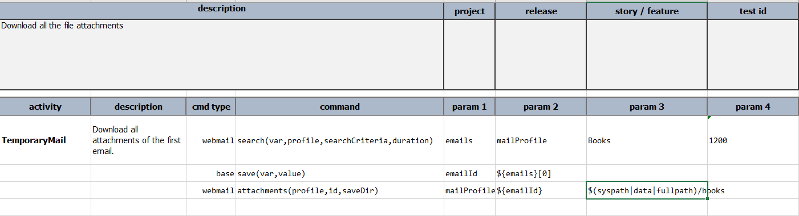
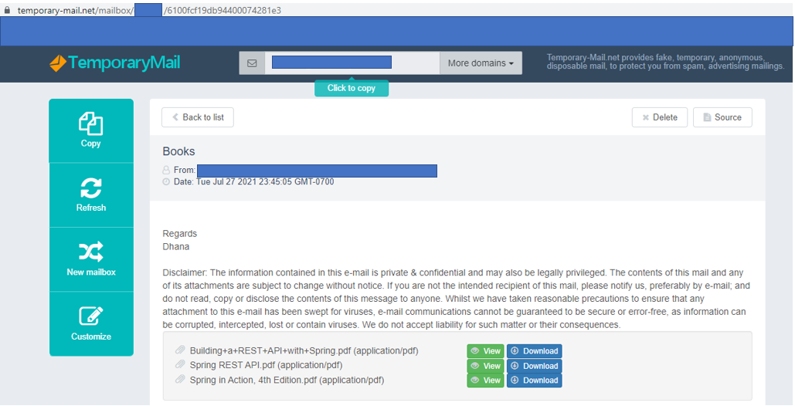
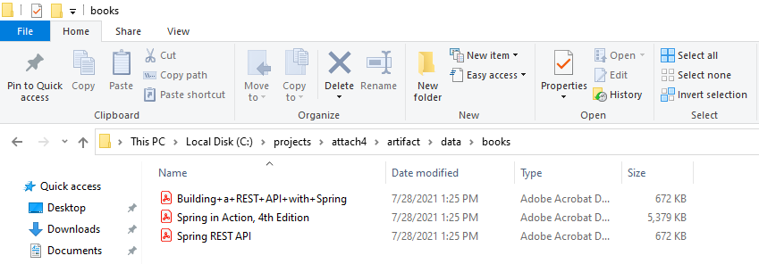
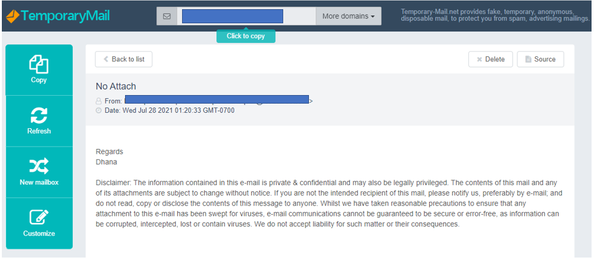
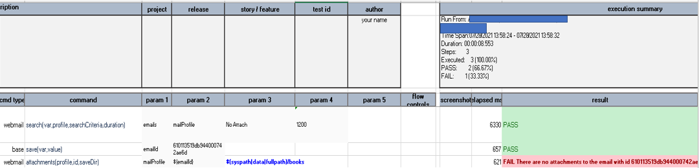

---
layout: default
title: attachments(profile,id,saveDir)
parent: webmail
tags: command mail mailinator webmail temporary-mail
comments: true
---****

### Description
This command instructs Nexial to download all the attachments of the email `id` corresponding to the 
[`profile`](index#webmail-configuration-settings). The `saveDir` represents the target "directory" to which
the attachments should be downloaded.

This "email id" is determined during the 
[`search(var,profile,searchCriteria,duration)`](search(var,profile,searchCriteria,duration)) command.

### Note: The following points to be taken into consideration before using the attachment commands.

- For the attachments command to work the email provider should be "temporary-mail". So the `provider`  value
in the [profile](index#webmail-configuration-settings) should be *temporary-mail*.
- [temporary-mail](https://temporary-mail.net) allows attachments size up to max of 7024 KB. This is the observation.
- You can add multiple files as attachments to an email sent to [temporary-mail](https://temporary-mail.net). However,
the overall size of the attachments should not exceed the Max size limit.

### Parameters
- **profile** - the *webmail* profile which [specifies the settings](index#webmail-configuration-settings) like 
  `inbox`, `provider` etc.
- **id** - the `id` of the email which contains the attachments.
- **saveDir** - the "directory" to which the email attachments are downloaded.

### Example 1 Download all the attachments.

**Script**:

The above script is trying to search for all the emails against the `profile` having the `searchCriteria` as *Books*.
The script extracts the email `id` of the first email that matches the `searchCriteria`.
Finally, the script downloads all the attachments to the directory specified against the `saveDir` which is the 
*books* folder inside the *data* directory of the project.

The screenshot below shows the email containing the attachments. You can see that the Email 
with `id` *6100fcf19db94400074281e3* has three attachments. Once the above script runs it will download all the 
attachments to the *books* folder as mentioned in the `saveDir`.

**Email**:

You can see the below screenshot where all the attachments are downloaded to the folder mentioned against `saveDir`.

**Output**:

### Example 2 Email with no attachments to download.

**Email**:

In the above email, you can see that the Email has no attachments to download. When we try to download attachments
for the same email it will give the error message as shown below.

**Output**:

### See Also
- [`search(var,profile,searchCriteria,duration)`](search(var,profile,searchCriteria,duration))
- [`read(var,profile,id)`](read(var,profile,id))
- [`delete(profile,id)`](delete(profile,id))
- [`attachment(profile,id,attachment,saveTo)`](attachment(profile,id,attachment,saveTo))
