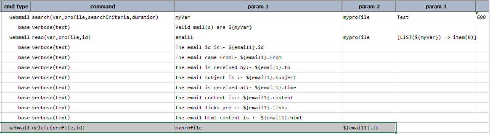

### Description
This command instructs Nexial to delete the email from the **inbox** specified against the `profile` configured.
The `id` represents the id of the email to be deleted. In case any of the below parameters are not set then the
operation cannot be performed resulting in an error.

### Parameters
- **profile** - the webmail profile in the `data` file which specifies the settings like inbox, mailProvider etc.
- **id** - the `id` of the email to be deleted.

Consider the following example script which deletes the email read earlier.

### Example
**Script**: 

 

### See Also
- [webmail &raquo; `search(var,profile,searchCriteria,duration)`](../webmail/search(var,profile,searchCriteria,duration))
- [webmail &raquo; `read(var,profile,id)`](../webmail/read(var,profile,id))