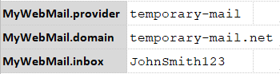

The "webmail" command type represents the automation command for reading and deleting emails from webmail providers 
(online-only email services). At this time, the following webmail providers are supported:
- [mailinator](https://www.mailinator.com) (DEFAULT)
- [temporary-mail](https://www.temporary-mail.net)

Future enhancement could include supporting multiple other webmail providers. In case you want us to support any other 
webmail providers, please let us know via the [GitHub Feature request form](https://github.com/nexiality/nexial-core/issues/new?template=feature_request.md). 
It'll help us prioritize future Nexial features.

In order to read emails, appropriate **mail-provider** and the **inbox** details need to be provided first. The section 
below describes how to specify the configuration settings.

### Webmail Configuration Settings
Nexial supports profile-based configuration for webmail automation. One can configure multiple profiles for different
webmail targets. Here are the various settings available to configure the webmail for your automation (assuming profile 
is `MyWebMail`):

| data variable        | description                                                                                   |
| -------------------- | --------------------------------------------------------------------------------------------- |
| `MyWebMail.provider` | **[optional]** the mail-provider used. Possible values are `mailinator` (default) or `temporary-mail`.|
| `MyWebMail.inbox`    | **[REQUIRED]** the name of the inbox (without domain name). |
| `MyWebMail.domain`   | [optional] For **`temporary-mail`** only. Specifies the domain used. |

 
 

#### Mailinator
Here are the settings for targeting [mailinator](https://www.mailinator.com/). Note that the `.provider` is optional.
 

 

The above settings will read emails from the Mailinator inbox with the specified inbox name:

 
 

Since Mailinator supports SMS messages, one can configure a burner phone number for the `.inbox` data variable to 
receive SMS messages.

#### Temporary-mail
Here are the settings for targeting [temporary-mail](https://www.temporary-mail.net).
 

 

The above settings will read emails from the temporary-mail.net **inbox** with the specified inbox name and the
**domain** name `temporary-mail.net` as shown below:

 
 

### Available Commands
- [webmail &raquo; `search(var,profile,searchCriteria,duration)`](../webmail/search(var,profile,searchCriteria,duration))
- [webmail &raquo; `read(var,profile,id)`](../webmail/read(var,profile,id))
- [webmail &raquo; `delete(profile,id)`](../webmail/delete(profile,id))
