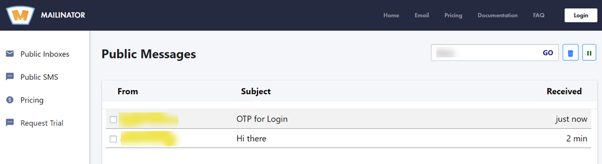

The "webmail" command type represents the automation command for reading emails from web mail-providers. By default, the
command uses [mailinator](https://www.mailinator.com/) as the web mail-provider. As of writing this command supports 
[temporary-mail.net](https://www.temporary-mail.net) as well. Future enhancement could include supporting multiple other
web mail-providers. In case you want us to support any other web mail-provider, please let us know via the 
[GitHub Feature request form](https://github.com/nexiality/nexial-core/issues/new?template=feature_request.md). It'll
help us prioritize future Nexial features.

In order to read emails, appropriate **mail-provider** and the **inbox** details need to be provided first.
The section below describes how to specify the configuration settings.
 

### Webmail Configuration Settings
Here are the various settings available to configure the appropriate webmail provider for your automation
(assuming profile is `MyWebMail`):

| data variable         | description                                                                    |
| --------------------- | ------------------------------------------------------------------------------ |
| `MyWebMail.mailProvider` | **[optional]** the mail-provider used. Default value is **mailinator**.|
| `MyWebMail.inbox`        | **[REQUIRED]** the name of the inbox.|
| `MyWebMail.domain`    | [optional] Used for the mail-provider **temporarymail-net** only. Specifies the domain used.|

 
 

#### Mailinator
Here are the settings for targeting [mailinator](https://www.mailinator.com/). Note that the mailProvider is optional.
 

 
 

The above settings will read emails from the Mailinator inbox with the name `dhana` as shown below:

 
 

#### Temporary-mail
Here are the settings for targeting [temporary-mail](https://www.temporary-mail.net).
 
 

 
 

The above settings will read emails from the temporary-mail.net **inbox** with the name `dhana` and the
**domain** name `temporary-mail.net` as shown below:

 
 

### Available Commands
- [webmail &raquo; `search(var,profile,searchCriteria,duration)`](../webmail/search(var,profile,searchCriteria,duration))
- [webmail &raquo; `read(var,profile,id)`](../webmail/read(var,profile,id))
- [webmail &raquo; `delete(profile,id)`](../webmail/delete(profile,id))
