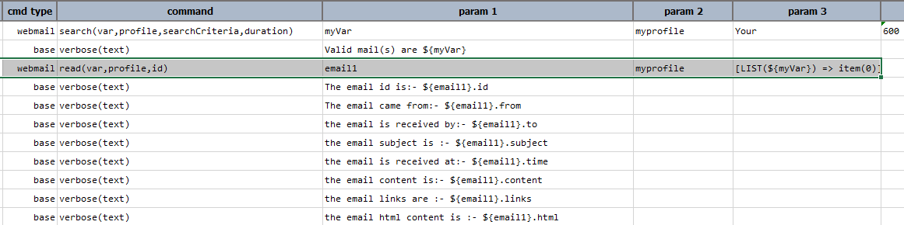

### Description
This command instructs Nexial to read email contents from the **inbox** specified against the `profile` configured.
The `id` represents the id of the email to be read. The details of the email will be saved into the variable name
specified against `var`. In case any of the below parameters are not set then the operation cannot be performed
resulting in an error.

### Parameters
- **var** - the target variable name to which the email details will be loaded to.
- **profile** - the webmail profile in the `data` file which specifies the settings like `inbox`, `mailProvider` etc.
- **id** - the `id` of the email to be read.

Consider the following example where you can read the details of an email based on its email id.

### Example
**Script**: 

 

In the above example you can see that once the email is read we can retrieve the following details from the email.
 

### Email Details
- **id** - The `id` of the email read.
- **from** - The `from` address of the email.
- **to** - The `to` address of the email.
- **subject** - The `subject` of the email.
- **time** - The `time` at which the email is received.
- **content** - The `text content` of the email.
- **links** - The list of the `html links` in the email.
- **html** - The `html` content of the email.

### See Also
- [webmail &raquo; `search(var,profile,searchCriteria,duration)`](../webmail/search(var,profile,searchCriteria,duration))
- [webmail &raquo; `delete(profile,id)`](../webmail/delete(profile,id))
