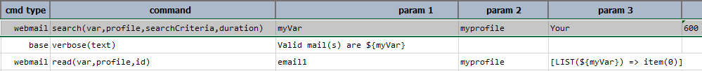

### Description
This command instructs Nexial to retrieve emails corresponding to the specified `profile`. The `profile` should be 
[configured](index#webmail-configuration-settings) with the appropriate webmail provider and inbox. This command
will retrieve the available email of the configured inbox based on 2 criterion:
- The email subject should contain the text specified in `searchCriteria`. Note that this is a "contains" search. If
  no criteria or `(empty)` is specified, then Nexial will consider emails of _any_ subject.
- The email should be less than `duration` since it was first received. In other words, the mail should have a 
  "received" time that is no more than the specified `duration` minutes.

For all the emails matching the above two criterion, their corresponding "email id" will be added to `var`. One can 
subsequently [retrieve the email content](read(var,profile,id)) or [delete it](delete(profile,id)) via such "email id".

#### Special Usage for `Temporary-Mail`
For those using [temporary-mail](index.html#temporary-mail) as the WebMail provider, note that new temporary-mail 
inbox needs to be "initialized" before it can receive emails. To perform such initialization, simply invoke this command 
with the `duration` parameter set to `0`. Nexial will initialize the target inbox so that it is ready to receiving 
incoming emails. Below is the recommended sequence of automation when using temporary-mail as the WebMail provider:

1. invoke `webmail` &raquo; `search(var,profile,searchCriteria,duration)`, setting `duration` to 0.
2. proceed with the activities that would result in email(s) being sent to the intended email address.
3. invoke `webmail` &raquo; `search(var,profile,searchCriteria,duration)`, setting `duration` to a number larger than 0.
4. continues on...

### Parameters
- **var** - the data variable to track a list of "email id" of the matching emails.
- **profile** - the webmail profile [configured](index#webmail-configuration-settings) for this command.
- **searchCriteria** - the text that be contained in the email subject.
- **duration** - the duration since the email was received. The unit of this duration is in **minutes** and it must be 
  a positive integer. Mails older than 24 hours cannot be retrieved; the max value of the duration will be 1440. 

### Example
**Script**: 

 

### See Also
- [`delete(profile,id)`](delete(profile,id))
- [`read(var,profile,id)`](read(var,profile,id))
- [mail &raquo; `send(profile,to,subject,body)`](../mail/send(profile,to,subject,body))
- [mail &raquo; `sendComposed(profile,var)`](../mail/sendComposed(profile,var))
