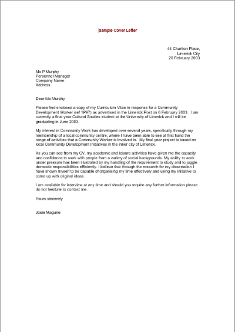
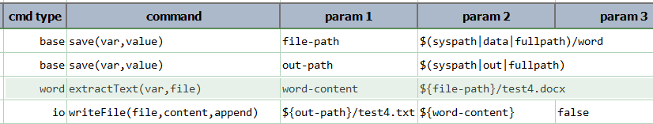
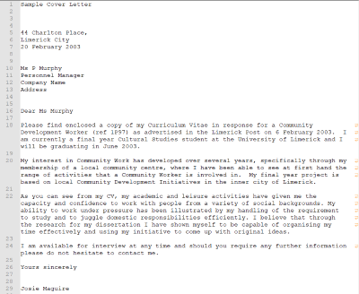

### Description
This command instructs Nexial to extract the entire text content from the specified Word `file` and save it to `var`.

Note that:
- Nexial currently supports only `.docx` or `.docm` file types.
- One should account for additional empty lines, for each empty paragraph fonud in the Word `file`.
- In most cases, bullet symbols will not be rendered into text. Microsoft Word (the program) generates the bullet 
  symbols during document display.
- For text in a table, each cell is separated by a TAB character (i.e. `(tab)`).

### Parameters
- **var** - the variable to store the extracted text.
- **file** - the fully qualified path of the target Word document.

### Example
Suppose we have the following Word document: 

We can use the following script to extract text content from this document: 

Below is the extracted text as a text file (note the line wraps): 

### See Also
- [`assertContains(file,text)`](assertContains(file,text))
- [`assertNotContain(file,text)`](assertNotContain(file,text))
