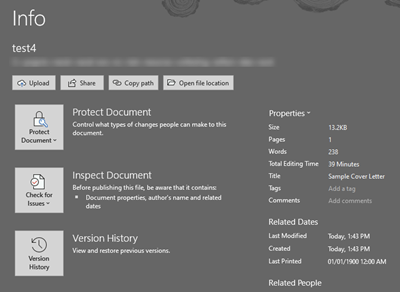
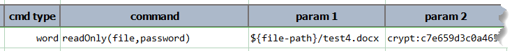
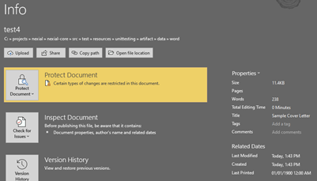
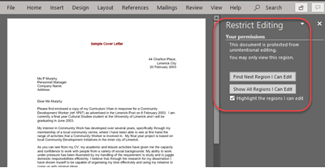

### Description
This command instructs Nexial apply the specified `file` with read-only restriction. Use `password` to restrict update 
access to the specified `file`.

### Parameters
- **file** - the fully qualified path of the target Word document.
- **password** - the password to protect the target Word document.

### Example
Suppose we have the following Word document that is not "protected": 

We can use this command to "password protect" this file: 

After execution, the same file is now "protected": 
 

### See Also
- [`assertNotReadOnly(file)`](assertNotReadOnly(file))
- [`assertReadOnly(file)`](assertReadOnly(file))
- [`removeProtection(file)`](removeProtection(file))