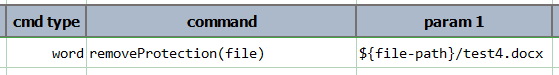

### Description
This command instructs Nexial to remove update restriction on the specified Word `file`.

### Parameters
- **file** - the fully qualified path of the target Word document.

### Example
Suppose we have a Word document that is currently protected from direct editing: 

With this command we can remove the protection: 
 

This file is no longer protected: 
 

### See Also
- [`assertNotReadOnly(file)`](assertNotReadOnly(file))
- [`assertReadOnly(file)`](assertReadOnly(file))
- [`readOnly(file,password)`](readOnly(file,password))