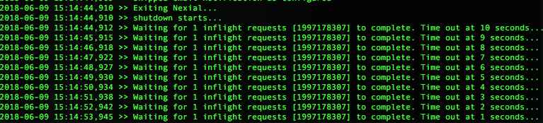

### Description
> This command is similar to [its `ws` counterpart](../ws/download(url,queryString,saveTo)), except for the 
asynchronous HTTP invocation and response handling.

This command is used to download the object from web using an url and save it in the given destination path. Optionally,
one may include `queryString` as required, or use `(null)` to signify that no query string is needed. The payload will 
be saved asynchronously to `saveTo` while the response information will be saved to another file named after `saveTo`,
as in `saveTo`.json. For example, suppose the following command: 

`ws.async | download(url,queryString,saveTo) | http://mysite.com/dl | file=A.zip | $(syspath|out|fullpath)/B.zip`

The target `A.zip` will be downloaded and saved as `B.zip` in the output directory, while another file named `B.zip.json` 
will be created in the output directory to capture the [response information](index#http-response).

If a particular download invocation requires more time than the execution, Nexial will attempt to wait for the download 
to complete.  The amount of wait time can be configured via the [`nexial.ws.async.shutdownWaitMs`](../../systemvars/index#nexial.ws.async.shutdownWaitMs) 
System variable. By default, Nexial set this System variable with a value of 180000, or 3 minutes. One may override the 
default in order to speed up or prolong the shutdown event. Below is a screenshot showing Nexial waiting 
(and counting down) for a particular asynchronous download to complete: 

To learn about how to manipulate the response returned from the target URL, visit [HTTP Response](index#http-response).

### Parameters
- **url** - the target URL
- **queryString** - query string for the specified URL. Use `(empty)` to indicate no query string to send
- **saveTo** - the location to save the downloaded file

### See Also
- [`delete(url,body,output)`](delete(url,body,output))
- [`put(url,body,output)`](put(url,body,output))
