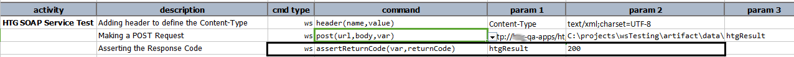
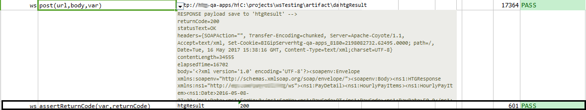

### Description
This command is used to assert the expected response code from the service response received.

For more information about HTTP status codes, refer to 
<a href="https://httpstatuses.com/" class="external-link" target="_nexial_external">https://httpstatuses.com/</a>.  

As of [v4.2](../../release/nexial-core-v4.2.changelog.md), Nexial supports `returnCode` expressed as multiple values
(separated by comma) or range (separated by dash). For example, specifying `returnCode` as `200-204,301,302,304` means
that the return code (from the response) should be one of the values in `200,201,202,203,204,301,302,304`.

This capability allows for more expressiveness and conciseness in your automation. 

### Parameters
- **var** - the variable to hold the [response](index.html#http-response) of a completed request
- **returnCode** - this is the HTTP Response code (e.g., 200, 500...)

### Example
**Script**: 

**Output**: 

### See Also
- [`delete(url,body,var)`](delete(url,body,var))
- [`put(url,body,var)`](put(url,body,var))
