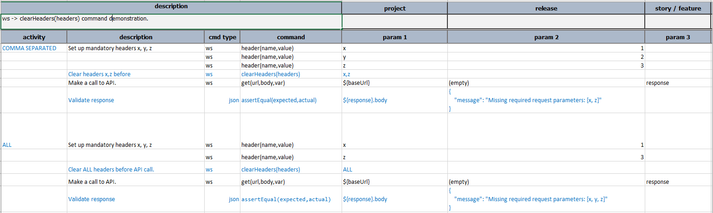

### Description
This command is used to clear the http request headers which were set previously. The `headers` value passed to this command
can be the `ALL`(representing all the headers set so far) or a comma separated list of headers to be cleared.

### Parameters
- **headers** - the value can be `ALL` or comma separated list of headers.

### Example
There are two activities in the example shown in the screenshot. In the first Activity `COMMA SEPARATED`, the headers
`x`, `z` are cleared. Since these headers are mandatory, when the method is invoked the response body message 
turns out to be *Missing required request parameters: [x, z].*

In the second Activity named `ALL`, all the headers are cleared. So when the method is invoked the response body message
turns out to be *Missing required request parameters: [x, y, z]*.

**Script**: 

### See Also
- [`header(name,value)`](header(name,value))
- [`headerByVar(name,var)`](headerByVar(name,var))